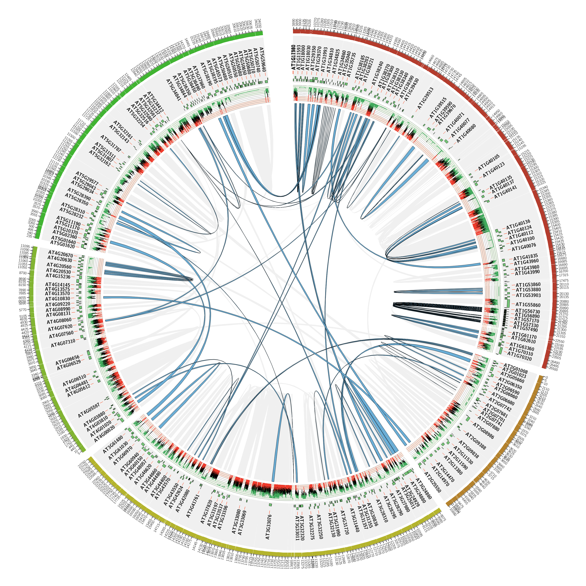

# SDDetector: a segmental duplication detection tool

SDDetector has been developed to detect segmental duplications in complete genomes. The principle is based on the bioinformatic protocol proposed by *Kahja et al.* Segmental duplications are defined as regions having a sequence similarity greater than 90% and a length greater than 5000 nt. Regions could be fragmented due to inversion/insertion/deletion events, so a maximium gap of 3000 nt is allowed between fragments. Then, fragments are chained together and the chains with required criteria are reported as potential duplicated regions. To fit with your genome specificity, SDDetector allows parameters modification to increase/reduce the sequence similarity threshold, the minimal length of the regions and the maximal gap size.
For an efficient detection, transposable and repetitive elements must be masked before sequence similarity search. If you do not provide a repetitive element annotation, results will contain a lot of false-positive regions. We recommend to perform a TE detection with the REPET package(*Flutre et al.*) or at least a minimal masking step with RepetMasker(*Smit et al.*).

SSDetector is developed by Nicolas Lapalu at [INRA-BIOGER](http://www.versailles-grignon.inra.fr/bioger). Please do not hesitate to contact me (nlapalu at versailles dot inra dot fr) if you have any comments or questions.

## Install

### Install SSDetector

prerequesite: 

* Python 2.7.X
* BioPython, only if you want to parse Blast results from xml format

```
wget https://github.com/nlapalu/SDDetector/archive/master.zip
unzip master.zip
cd SDDetector-master
```

If you want to test the code:

`python setup.py test`

System install (as root):

`python setup.py install`

or user install (you will have to (re)set your PYTHONPATH and PATH):

`python setup.py install prefix==/my/user/directory`

### Additional tools

* bedtools
* ncbiblast+

## Running SDDetector

* genome.fasta is your genome in multi-fasta file
* genome_TE.gff is the Transposable, Repeat elements annotation file in gff3  

### Build a masked blast database

__Convert the genome fasta file in a soft-masked fasta file (upper cases to lower cases)__

`maskFastaFromBed -fi genome.fasta -fo genome_masked.fasta -bed genome_TE.gff -soft`

__Index your genome with masking information__

`convert2blastmask -in genome_masked.fasta -parse_seqids -masking_algorithm REPET -masking_options "REPET, URGI" -outfmt maskinfo_asn1_bin -out genome_masked.asnb`

`makeblastdb -dbtype nucl -in genome_masked.fasta -out genome_masked -parse_seqids -mask_data genome_masked.asnb`

__Check your masking info:__

`blastdbcmd -db genome_masked -info`

```
Database: /tmp/genome_masked.fasta
    28 sequences; 50,819,261 total bases

Date: Feb 23, 2016  4:05 PM    Longest sequence: 6,042,495 bases

Available filtering algorithms applied to database sequences:

Algorithm ID  Algorithm name      Algorithm options                       
100           other               REPET, URGI                             

Volumes:
    /tmp/genome_masked
```
### Perfom blast analysis

__Blast in XML format:__

`blastn -num_threads 2 -task megablast -db genome_masked -query genome.fasta -out blast.xml -outfmt 5 -db_soft_mask 100`

__Blast in tab-delimited format with required fields:__

`blastn -num_threads 2 -task megablast -db genome_masked -query genome.fasta -out blast.tab -outfmt "6 qseqid sseqid qstart qend sstart send length nident" -db_soft_mask 100`

### Detect Segmental Duplications

__Detection from xml format:__

`segmental_duplication_detector.py blast.xml xml sdd_0.9_3000_5000.gff3 :memory: -g 3000 -l 5000 -a`

__Detection from tab-delimited format:__

`segmental_duplication_detector.py blast.tab tab sdd_0.9_3000_5000.gff3 :memory: -g 3000 -l 5000 -a`

### Analyze duplicated genes

If you ask for a Blast XML output and you have a gene annotation file in gff3 format, you can use the SDAnalyzer tool.

__Analyze polymorphism between duplicated genes:__

`segmental_duplication_gene_analyzer.py sdd_0.9_3000_5000.gff3 blast.xml genes.gff3 gene_analyze.out -t genome_TE.gff -g genome.fasta --circos`

For each couple of genes, you get the list of the polymorphisms with positions, and an alignment-like representation with translation.
This view allows a comprehensive impact of each polymorphism on protein sequences (synonymous, non-synonymous mutations).

```
Gene: (G0001,G0002); sequence: (seq11,seq11); strand: (-1,1)
33 : G - - --- (seq11-40161,seq11-554869)
34 : C - - --- (seq11-40160,seq11-554869)
35 : G - - --- (seq11-40159,seq11-554869)
46 : G - A --- (seq11-40148,seq11-554879)
66 : G - A --- (seq11-40128,seq11-554899)
80 : C - T --- (seq11-40114,seq11-554913)
95 : G - A --- (seq11-40099,seq11-554928)
168 : A - T --- (seq11-40026,seq11-555001)
172 : C - A --- (seq11-40022,seq11-555005)
190 : A - G --- (seq11-40004,seq11-555023)
234 : C - T --- (seq11-39960,seq11-555067)
239 : C - T --- (seq11-39955,seq11-555072)
246 : T - C --- (seq11-39948,seq11-555079)
266 : G - A --- (seq11-39928,seq11-555099)
267 : T - A --- (seq11-39927,seq11-555100)
278 : T - C --- (seq11-39916,seq11-555111)
288 : C - A --- (seq11-39906,seq11-555121)
297 : T - C --- (seq11-39897,seq11-555130)
351 : C - T --- (seq11-39843,seq11-555184)
405 : T - G --- (seq11-39789,seq11-555238)
429 : A - G --- (seq11-39765,seq11-555262)
477 : T - C --- (seq11-39717,seq11-555310)
518 : A - G --- (seq11-39676,seq11-555351)
541 : G - C --- (seq11-39653,seq11-555374)
577 : C - G --- (seq11-39617,seq11-555410)
619 : A - G --- (seq11-39575,seq11-555452)
641 : T - G --- (seq11-39553,seq11-555474)
691 : G - A --- (seq11-39503,seq11-555524)
754 : T - C --- (seq11-39440,seq11-555587)
779 : C - A --- (seq11-39415,seq11-555612)
40193                                                  40133
 M  T  P  H  S  L  T  D  K  Q  A  R  Q  R  L  E  A  L  Q  L 
------------------------------------------------------------
ATGACGCCGCACAGCTTGACGGACAAGCAGCGGCGCCAGCGCCTTGAAGCCCTGCAACTT
                                |||          |              
ATGACGCCGCACAGCTTGACGGACAAGCAGCG---CCAGCGCCTTAAAGCCCTGCAACTT
--------------------------------   -------------------------
 M  T  P  H  S  L  T  D  K  Q  R     Q  R  L  K  A  L  Q  L 
554837                                                554894

40134                                                  40074
 Y  L  N  E  P  E  P  V  L  I  C  A  P  C  G  Y  A  L  K  P 
------------------------------------------------------------
TACTTGAACGAGCCTGAACCGGTCCTCATCTGCCGGCCTTGCGGTTACGCATTGAAGCCG
     |             |              |                         
TACTTAAACGAGCCTGAACTGGTCCTCATCTGCCAGCCTTGCGGTTACGCATTGAAGCCG
------------------------------------------------------------
 Y  L  N  E  P  E  L  V  L  I  C  Q  P  C  G  Y  A  L  K  P 
554895                                                554955

.....
```

## Example

Examples are provided in data directory. If you want to test your install and have a look to the expected file formats, you can run a complete analysis.

### Example 1: Subset of a fungal genome 

soon available


### Example 2: Arabidopsis thaliana

Data:
```
tar -xvf data/arabido.tar.gz 
```

Precompute data:
```
maskFastaFromBed -fi TAIR10.fasta -fo TAIR10_masked.fasta -bed TAIR10_GFF3_transposons.gff -soft

convert2blastmask -in TAIR10_masked.fasta -parse_seqids -masking_algorithm TE -masking_options "TE" -outfmt maskinfo_asn1_bin -out TAIR10_masked.asnb

makeblastdb -dbtype nucl -in TAIR10_masked.fasta -out TAIR10_masked -parse_seqids -mask_data TAIR10_masked.asnb

blastn -num_threads 15 -task megablast -db TAIR10_masked -query TAIR10_masked.fasta -out TAIR10.xml -outfmt 5 -db_soft_mask 100 
```

Analyze:
```
../../bin/segmental_duplication_detector.py TAIR10.xml xml sdd.gff3 ':memory' -v 2 -t 300

../../bin/segmental_duplication_gene_analyzer.py sdd.gff3 TAIR10.xml TAIR10.new.gff3 TAIR10.out -g TAIR10.fasta --circos -v 3
```

Generate graph with Circos:
`circos -conf circos.conf`



## How to cite

If you use SDDetector, please cite:

*__SDDetector, Lapalu.N, https://github.com/nlapalu/SDDetector__*

## References

* Flutre T, Duprat E, Feuillet C, Quesneville H. Considering transposable element diversification in de novo annotation approaches. PLoS One. 2011 Jan 31;6(1):e16526. doi: 10.1371/journal.pone.0016526. 
* Khaja R, MacDonald JR, Zhang J, Scherer SW. Methods for identifying and mapping recent segmental and gene duplications in eukaryotic genomes. Methods Mol Biol. 2006;338:9-20.
* Smit, AFA, Hubley, R & Green, P. RepeatMasker Open-4.0. 2013-2015 <http://www.repeatmasker.org>. 
